صوت و صدى

Description:
sout-wa-sada, also called voice and echo, is a react based web application dedicated to highlighting arabic music and cultural heritage. The website's goal is to give a glimpse of the arabic art, igniting users to explore more. This is achieved using an introduction dedicated to three of the legendary Arabic artists, providing mood-based song recommendations, an interactive personality quiz, hence exploring the relationship between poetry and music.

Setup Instructions
Clone the repository:
git clone https://github.com/AlaaBarakat-star/sout-wa-sada.git
Navigate to the project folder:
cd sout-wa-sada
Install dependencies:
npm install
Start the development server:
npm run dev
Open the local URL displayed in the terminal.

screenshots of the UI:

##home page:
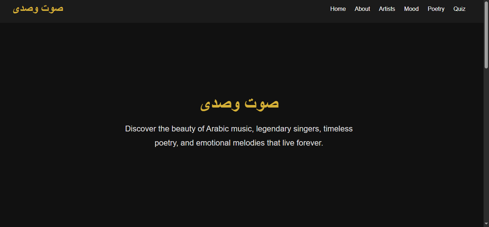
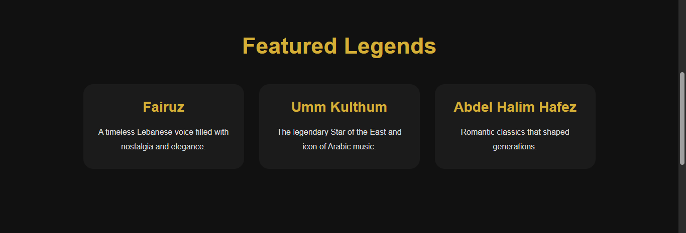
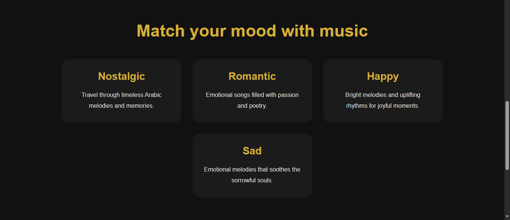

##about page:
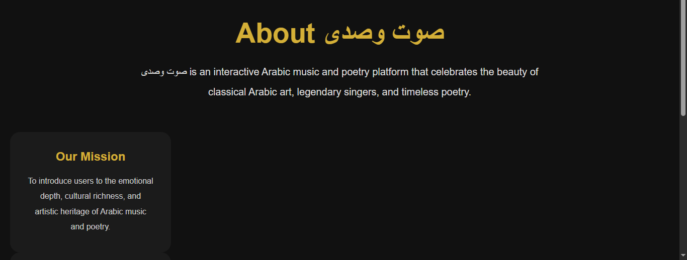

##artists page:
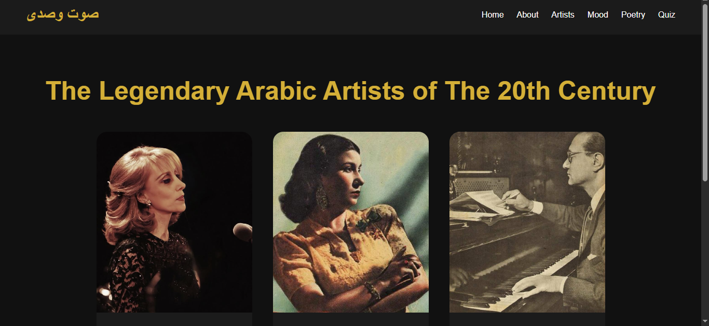
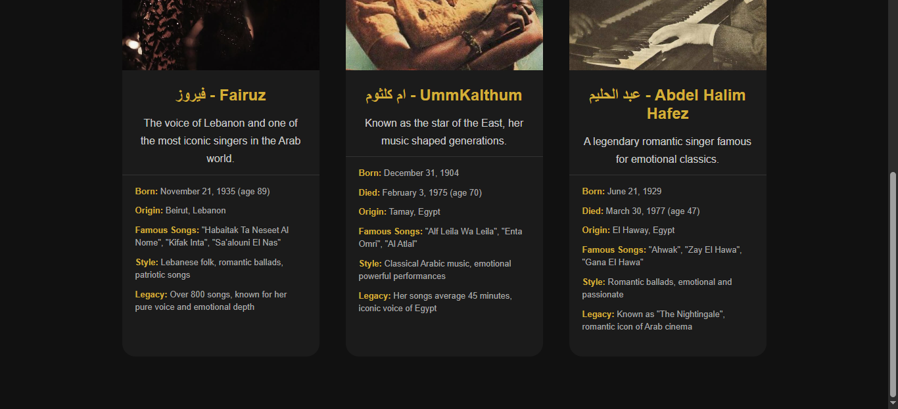

##mood page:

##quiz page:
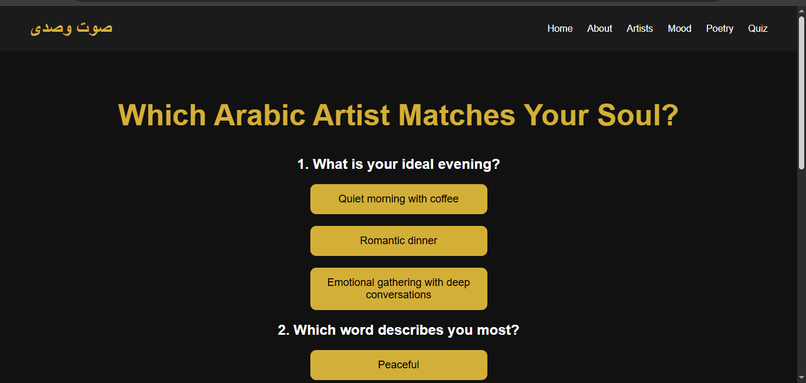

##poetry page:
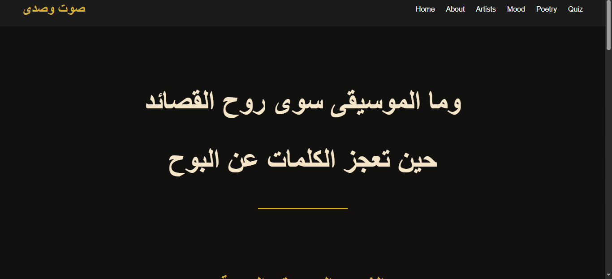
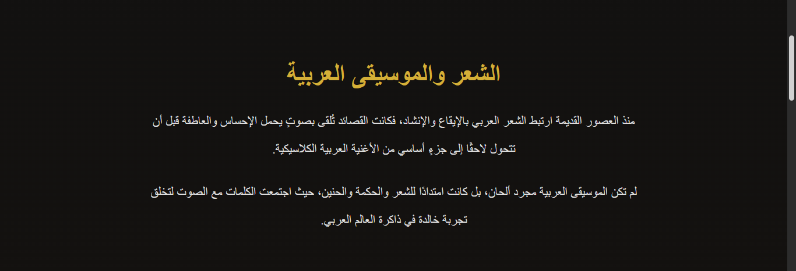
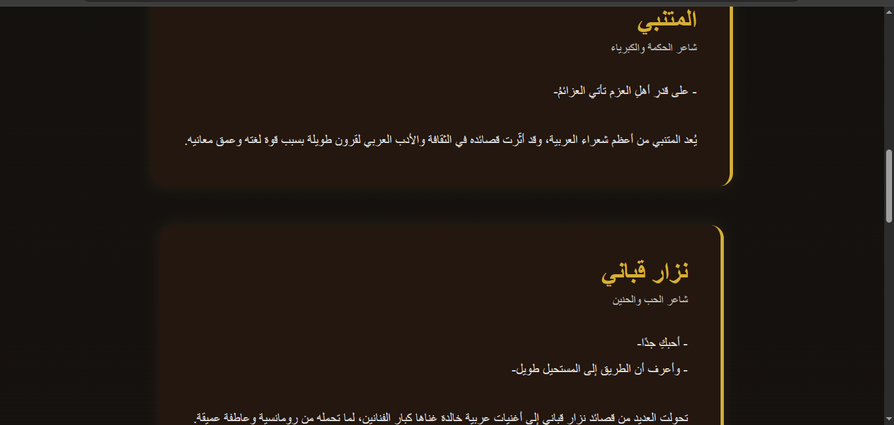
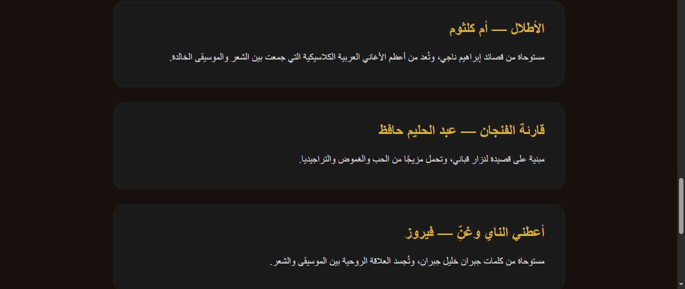

